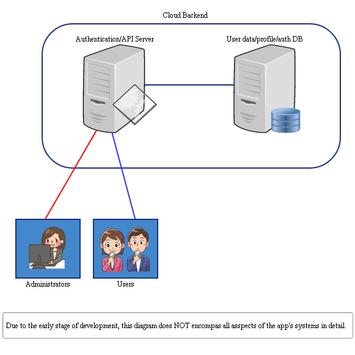
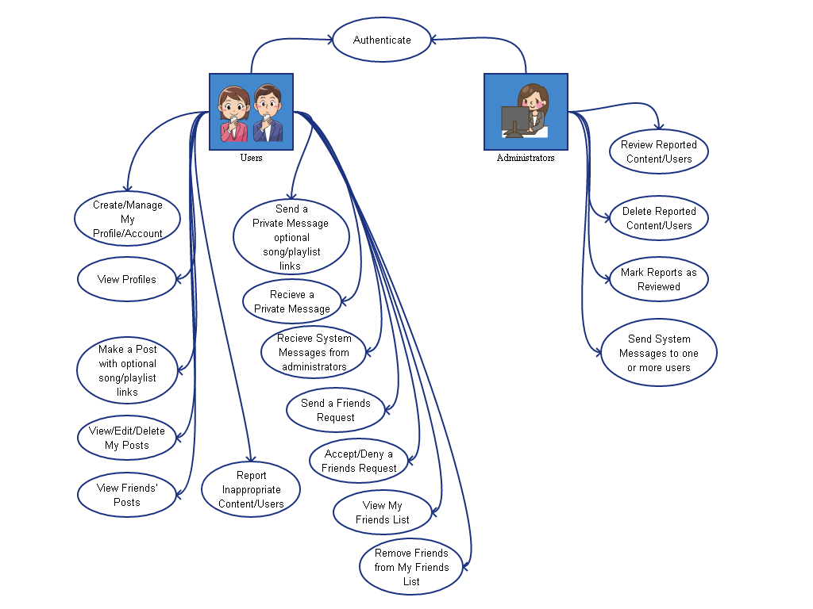
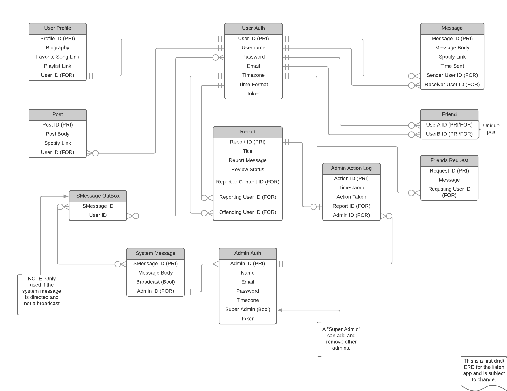

# Table of Contents
1. [Basic Project Information](https://github.com/skoliver89/listen#basic-project-information)
2. [Moto](https://github.com/skoliver89/listen#moto)
3. [Vision Statement](https://github.com/skoliver89/listen#vision-statement)
4. [Needs/Features, Requirements & Risks](https://github.com/skoliver89/listen#needsfeatures-requirements--risks)
    * [Needs/Features](https://github.com/skoliver89/listen#needsfeatures)
    * [Requirements](https://github.com/skoliver89/listen#requirements)
    * [Non-Functional Requirements](https://github.com/skoliver89/listen#non-functional-requirements)
    * [Risks](https://github.com/skoliver89/listen#risks)
5. [Modeling Artifacts](https://github.com/skoliver89/listen#modeling-artifacts)
    * [Architecture Diagram](https://github.com/skoliver89/listen#architecture-diagram)
    * [Use-Case Diagram](https://github.com/skoliver89/listen#use-case-diagram)
    * [ER Diagram](https://github.com/skoliver89/listen#er-diagram)
6. [Contribution Guidelines](https://github.com/skoliver89/listen#contribution-guidelines)

# Basic Project Information
* Project Name: listen
* Author Name: Stephen K Oliver
* Version Number: 0.1a
* Version Date: \<TBA\>
* VSTS Site (Product Backlog): https://skoliver14.visualstudio.com/listen
* APP Download Link: \<TBA\>
* Accepting Outside Contributions: No

[Table of Contents](https://github.com/skoliver89/listen#table-of-contents)

# Moto
Discover life's soundtrack.

[Table of Contents](https://github.com/skoliver89/listen#table-of-contents)

# Vision Statement
For music lovers who do not have Facebook, the listen app is a social media platform to share what you are currently listening to, your playlists and favorite songs, artists, and/or genres. Unlike the current system utilizing Facebook accounts, users will have the option to remain anonymous. Also, unlike the current system your Spotify account credentials will not rely on your listen account; This means that a user can freely remove their listen account and still retain the same Spotify account.

[Table of Contents](https://github.com/skoliver89/listen#table-of-contents)

# Needs/Features, Requirements & Risks

[Table of Contents](https://github.com/skoliver89/listen#table-of-contents)

## Needs/Features
* New users can create an account
* Users can edit their account (Username, password, etc.)
* Users can delete their account
* Users can log in
* Users can log out
* Users can tether their Spotify account with their listen account
* Users can send friends requests
* Users can accept/deny friends requests
* Users can view their own friends list
* Users can remove friends from their own friends list
* Users can create their profile
* Users can edit their profile
* Users can display a favorite song on their profile
* Users can display a favorite playlist on their profile
* Users can display a short Bio on their profile
* Users can display what they are currently listening to on their profile
* Users can View their friends' profiles
* Users can create posts with optional links to a song or playlist on Spotify
* Users can view their own posts
* Users can edit and delete their own posts
* Users can view their friends' posts
* Users can send Private Messages to friends
* Users can receive/view Messages from friends
* Users can report inappropriate/offensive content and users
* Administrators can log in
* Administrators can log out
* Administrators can review reported content and users
* Administrators can mark reports as reviewed
* Administrators can delete reported content and users
* Administrators can send system messages to one or more users
<!-- More Needs/Features Here As Required -->

[Table of Contents](https://github.com/skoliver89/listen#table-of-contents)

## Requirements
* Authentication
  * Main App account: ASP.NET Web API 2.2 Authentication
  * Spotify Tethering: May need to OAUTH through Spotify API; however, this is an advanced future feature
  * CAPTCHA to eliminate/reduce spam bots; advanced future feature
  * Password recovery
  * Log in lock-out (6 failed attempts) 30 minute penalty
* Editable User account items:
  * Username (requires re-authentication)
  * Email account (requires re-authentication)
  * Password (requires re-authentication)
  * Time zone; advanced future feature. Listen will use Zulu (GMT) time by default.
  * Time format (i.e. 1300 or 1:00pm); advanced future feature. Listen will use the standard am/pm format by default.
* Other required account items (Non-editable)
  * Spotify user ID/OAUTH credentials
  * Authentication token
* User Profile feature requirements
  * Header: Username
  * Sub Header: The song that the user is currently listening to, if any
  * Body1: (optional) Bio & a list of their ten most recent posts
  * Body2: Favorite Song & Main/Selected playlist
* Viewing a friend's profile feature requirements
  * Should mirror user profile standard
  * Have a button to remove a friend from their friends list
  * Have a button to flag the profile for inappropriate/offensive content (Report)
* Friends list feature requirements
  * Alphabetized list of current friends
  * The songs friends are currently listening to
  * Should be tap-able to open the messaging window
  * Indication of a new message from a friend(s)
  * Online/Offline Status; advanced future feature
* User Messaging Window
  * Header: tap-able username pointing to selected friend's profile
    * Have a button to flag the profile for inappropriate/offensive content (Report)
  * Body: Historical list of messages, newest on bottom (limit most recent 50 for now)
  * Footer: text input box & send button
  * Users should be able to tap outside of chat window to close
* Viewing friends' posts feature requirements
  * Posts should appear on the main screen (refresh every 30(?) seconds)
  * Posts should appear in order of most recent at top
  * Posts should be scrollable (infinite?)
  * Posts should be no more than 14(?) days old (maintain most recent and relevant posts)
  * Each post should contain a header displaying the following:
    * User who published the post
    * The song that the user was listening to at the time of the post
    * A button to generate a report of the post for inappropriate/offensive content
  * Each post should contain a message body
  * Each post should have the option of a footer containing a link to a song or playlist
* User reporting feature requirements
  * Display user being reported
  * Display content being reported
  * Text box to enter a report title
  * Text area to enter a report message
* Handling users not yet authenticated
  * redirect to log in prompt
* What authenticated users can see
  * Their account details
  * Their friends list
  * Their profile (details above)
  * Their stream of posts from friends
  * Their friend's profiles (same content/layout as their profile)
  * Messages from their friends
* Handling administrators not yet authenticated
  * redirect to log in prompt
* What authenticated administrators can see
  * A list of pending review reports (tap-able/selectable)
  * A list of their closed reports (up to 30 days)
  * Selected reported content and/or user data to include user report message and reported content/user
  * A console to send system messages
* Selected Report feature requirements
  * Report Title
  * The user in question
  * The content in question, if a content report
  * The username of the user whom filed the report
  * A list of other reports connected to the user in question (expandable/retractable?)
    * Report Title and action taken, if any
  * Resolution buttons (i.e. No Action Required, Delete Content, Suspend User, Delete User, ETC)
<!-- More Requirements Here As Required -->

[Table of Contents](https://github.com/skoliver89/listen#table-of-contents)

## Non-Functional Requirements
* Storage Requirements
  * Local DB to store currently visible data (optimize look up and reduce strain on API server)
* User Access Controls
  * ASP.NET Web API 2.2 Authentication (main)
  * Possibly add in Spotify OAUTH as required
* Database System
  * MS SQL hosted in Microsoft Azure
  * Contains:
    * Authentication/User Account Table
    * User Profile Table
    * Posts Table
    * Messages Table
    * Reports Table
    * Admin Actions Log Table
* Other
  * Android Smartphone with touch capabilities (OS version Kit-Kat 4.4 or better)
  * Spotify account (may require premium, further research required)
  * Valid E-mail account
  * Access to data network/Wi-Fi
<!-- More Non-Functional Requirements Here As Required -->

[Table of Contents](https://github.com/skoliver89/listen#table-of-contents)

## Risks
* Have to learn the Android Development Framework
* Have to learn Kotlin Language
* Have to learn how to deploy a mobile app with a cloud-based backend
* Have to learn how to authenticate a user to my app and tie that profile to a Spotify account
* Have to learn how to properly utilize the Spotify API (possibly the SDK)
* Familiarize with ASP.NET Web API 2.2 including authentication

[Table of Contents](https://github.com/skoliver89/listen#table-of-contents)

# Modeling Artifacts
## Architecture Diagram

[Table of Contents](https://github.com/skoliver89/listen#table-of-contents)

## Use-Case Diagram

[Table of Contents](https://github.com/skoliver89/listen#table-of-contents)

## ER Diagram

[Table of Contents](https://github.com/skoliver89/listen#table-of-contents)

# Contribution Guidelines
## All Contributors must review with and adhere to the following:
* Please review our contribution requirements: [here](CONTRIBUTING.md)
* Please review our Code of Conduct requirements: [here](CODE_OF_CONDUCT.md)
* Please review our Pull Request Template requirements: [here](PULL_REQUEST_TEMPLATE.md)

[Table of Contents](https://github.com/skoliver89/listen#table-of-contents)
